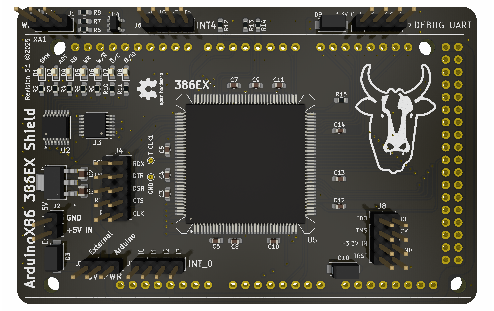

# ArduinoX86 386EX Shield V5

- This is the latest shield design for the 386EX CPU. It supports the addition of a 387SX FPU via stacking headers.

- The 386EX is a low-voltage variant of the 386 with a 16-bit data bus, intended for embedded applications.

- This shield is intended to be **only compatible with the Arduino GIGA board**.

### Important power-related notes:

- This shield has external power pins. You may connect a 3.3V or 5V power source to the pins, i.e. via 0.1" / 2.54mm "DuPont" connectors.

- You may find that the CPU runs even without external power. This is due to the CMOS process - many CMOS CPUs can power themselves by sinking current from any input pin. Correct operation in this state is not guaranteed and has not been battle-tested.

### Notes about 386EX CPUs:

- Unsoldered new-old-stock 386EX chips are often available on eBay, but your mileage may vary.

### Other notes:

If using a donor board, a hot plate or hot-air station will be necessary to successfully remove the CPU without damage.

This shield adds new features over the original:

- PEREQ and ERROR pins have been connected to support stacking a 387SX shield,
- The SMI and SMIACT pins have been connected,
- The JTAG pins have been replaced by a 2x4 header, in popular 0.1" / 2.54mm "DuPont" pins,
- The first Asynchronous serial port has been replaced by a 2x5 header (Serial0),
- The first 8 external INTR lines (INTR0-INTR7) have been run out to separate 1x4 headers,
- 7 status LEDs have been added that will report the status of SMIACT, ADS, RD, WR, W/R, C/M and M/IO.

### Improvements (v5.x) over the previous design (v4) include:

- Added ST LDL1117 1A voltage regulator for the 3.3V bus; this enables users to select from a 5V external power source, 5V input via Arduino pin headers, and 3.3V input via the JTAG/debug header.
- Migrated to 4-layer PCB, and migrated most serial and data traces to the 2x internal copper layers.
- Rounded PCB traces for improved data signal integrity.
- Resized silkscreen labels from 1.0mm to 0.8mm and improved layout.
- Improved schematic layout by grouping major components and subsystems together, for easier readability.
- Added standard diodes to protect 5V and 3.3V inputs and busses from accidental back-feeding.
- Added high-resolution renders of board front and back, populated and depopulated, for improved clarity in assembly diagrams.
- Added note about customizing LED current-limiting resistor values per their current and forward voltage.
- Added BOM to this README.
- Added interactive HTML BOM.
- Added schematic and PCB layout `.PDF` files.
- Added `/production` folder with ready-to-fabricate `.zip` file and `.csv` files for communicating with PCB fabrication houses.

### WARNING!
> Successfully assembling this board requires advanced soldering skills. A solder mask, solder paste, and a hot plate are recommended. (Or in a pinch, a high proficiency with drag-soldering techniques.)

### BOM

Note: Interactive HTML bill of materials is available in `./bom/ibom.html`.

| Reference | Value | Footprint | Quantity |
| --------- | ----- | --------- | -------- |
| C3, C4, C5, C6, C7, C8, C9, C10, C11, C12, C13, C14 | 0.1 µF | C_0603 | 12 |
| C1 | 4.7 µF | C_0805 | 1 |
| C2 | 1 µF | C_0805 | 1 |
| R2, R3, R4, R5, R9, R10, R11 | User's TBD | R_0603 | 7 |
| R1, R6, R7, R8, R12, R13, R14, R15 | 3.3 K Ω | R_0603 | 7 |
| D1, D2, D4, D5, D6, D7, D8 | 20mA green |  D_0603 | 7 |
| D3, D9, D10 | S1A-13-F | DIOM5226X240N | 3 |
| U1 | LDL1117S33R | SOT223_STM-M | 1 |
| U2 | ULN2003A | TSSOP-16_4.4x5mm_P0.65mm | 1 |
| U3 | SN74LV14A | TSSOP-14_4.4x5mm_P0.65mm | 1 |
| U4 | AT24CS01-STUM | SOT-23-5 | 1 |
| U5 | I386EX_PQFP | PQFP-132_24x24mm_P0.635mm_i386 | 1 |
| J5, J6, J7 | 4-pin DuPont | PinHeader_1x04_P2.54mm_Vertical | 3 |
| J1, J3 | 3-pin DuPont | PinHeader_1x03_P2.54mm_Vertical | 2 |
| J2 | 2-pin DuPont | PinHeader_1x02_P2.54mm_Vertical | 1 |
| J4 | 2x5-pin DuPont | PinHeader_2x05_P2.54mm_Vertical | 1 |
| J8 | 2x4-pin DuPont | PinHeader_2x04_P2.54mm_Vertical | 1 |
